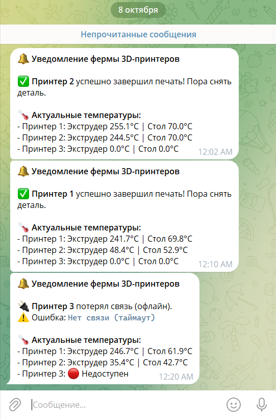
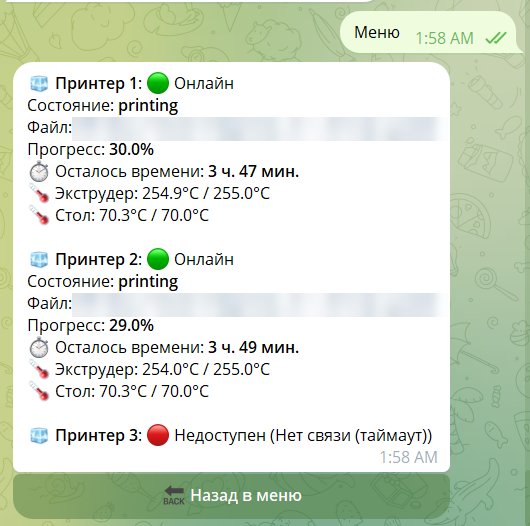
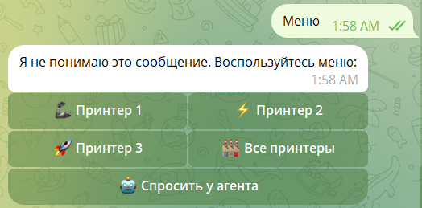
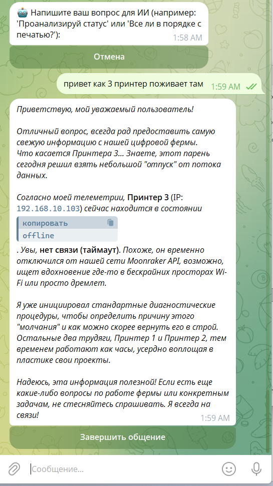

# printer-farm-bot

Telegram-бот для моей домашней фермы из трех 3D-принтеров Flashforge Adventurer 5M (Klipper / Forge-X).
Следит за принтерами и пишет в Telegram, когда печать закончилась, принтер ушел в ошибку или пропал из сети.

Принтеры стоят у меня дома, а бот работает на сервере в другой сети, поэтому большая часть проекта — это не только код, но и сеть: WireGuard между двумя квартирами, прокси для заблокированных API, reverse proxy для веб-интерфейса. Настройка сети и поиски обходов оказались интереснее создания самого бота.

## Что умеет

- **Уведомления** — раз в 30 секунд опрашивает принтеры через Moonraker API и пишет при смене состояния: печать завершена, пауза/отмена, ошибка Klipper (с текстом ошибки), потеря связи и возвращение в сеть.
- **Статус** — температуры сопла и стола, имя файла, прогресс и оставшееся время.
- **Управление** — пауза, продолжение, отмена печати.
- **Загрузка G-code** — отправляешь файл боту, он заливает его на выбранный принтер и при желании запускает печать.
- **Fluidd и камеры** — открываются прямо из Telegram как Web App.
- **Чат с Gemini** — можно спросить про состояние фермы, в запрос подставляется текущая телеметрия.

Честно: каждый день я пользуюсь в основном уведомлениями.

## Как это выглядит

<table>
  <tr>
    <td align="center"><b>Уведомления</b></td>
    <td align="center"><b>Статус принтеров</b></td>
  </tr>
  <tr>
    <td valign="top"></td>
    <td valign="top"><br><br><b>Меню</b><br></td>
  </tr>
  <tr>
    <td align="center" colspan="2"><b>Чат с Gemini</b></td>
  </tr>
  <tr>
    <td align="center" colspan="2"></td>
  </tr>
</table>

## Схема

```
  Сервер (Ubuntu, Docker)                        Дом
 ┌──────────────────────────┐             ┌──────────────────────┐
 │ 3dprinter_bot            │  WireGuard  │ Роутер OpenWrt       │
 │   ├─ Moonraker API ──────┼─────────────┼─► 192.168.10.0/24    │
 │   └─ Telegram, Gemini ─┐ │             │   ├─ принтер 1 .101  │
 │ 3dprinter_proxy        │ │             │   ├─ принтер 2 .102  │
 │   sing-box (VLESS) ◄───┘ │             │   └─ принтер 3 .103  │
 └──────────────────────────┘             └──────────────────────┘
```

> На самом деле принтеры стоят в отдельном помещении, и к ним идет еще один роутер, но он используется как коммутатор и особо не играет роли в схеме и дальнейших объяснениях, поэтому далее о нем ничего не будет сказано.

- Запросы к принтерам идут напрямую через WireGuard-туннель до домашнего роутера.
- Telegram и Gemini — через контейнер с sing-box: Gemini не работает с российских IP, а `api.telegram.org` режет провайдер сервера.
- Уведомления собираются из обычных шаблонов, без ИИ, чтобы приходили даже если прокси лежит.

Подробно — в [docs/01-ARCHITECTURE.md](docs/01-ARCHITECTURE.md).

## Стек

Python 3.10, aiogram 3, aiohttp, google-generativeai (Gemini 2.5 Flash), Docker Compose, sing-box, WireGuard / AmneziaWG, OpenWrt, Caddy, Fluidd, Moonraker.

## Структура

```
bot.py                 точка входа
src/
  config.py            настройки из .env, список принтеров
  client/moonraker.py  запросы к Moonraker API
  client/gemini.py     запросы к Gemini и чистка HTML под Telegram
  handlers/            меню, управление, загрузка файлов, чат
  middlewares/auth.py  доступ только для своих
  services/monitor.py  фоновый опрос и уведомления
scripts/               скрипты для настройки Moonraker на принтерах
docs/                  документация по сети, деплою и граблям
```

## Запуск

```bash
cp .env.example .env                                   # заполнить токены
cp sing-box-config.example.json sing-box-config.json   # данные своего VLESS-сервера
docker compose up -d --build
docker logs -f 3dprinter_bot
```

Если прокси не нужен, можно убрать сервис `proxy` из `docker-compose.yml` и оставить `GEMINI_PROXY` пустым.
IP принтеров задаются в `src/config.py`.

## Документация

| | |
|---|---|
| [01-ARCHITECTURE](docs/01-ARCHITECTURE.md) | общая схема и потоки данных |
| [02-NETWORK](docs/02-NETWORK.md) | WireGuard, роутер, DHCP, Caddy |
| [03-BOT-CODE](docs/03-BOT-CODE.md) | устройство кода |
| [04-DEPLOYMENT](docs/04-DEPLOYMENT.md) | Docker и деплой |
| [05-PROXY](docs/05-PROXY.md) | прокси-контейнер |
| [06-PRINTERS](docs/06-PRINTERS.md) | принтеры и Moonraker API |
| [07-FLUIDD-CADDY](docs/07-FLUIDD-CADDY.md) | веб-интерфейс и камеры |
| [08-SECURITY](docs/08-SECURITY.md) | доступ и безопасность |
| [09-TROUBLESHOOTING](docs/09-TROUBLESHOOTING.md) | типовые проблемы |
| [10-RUNBOOK](docs/10-RUNBOOK.md) | обновление и перезапуск |
| [11-HISTORY](docs/11-HISTORY.md) | история и грабли, на которые наступил |

## Известные проблемы

Проект учебный и живет у меня дома, так что есть что улучшать:

- отмена печати срабатывает с одного нажатия, без подтверждения;
- если принтер выключен, кнопки паузы/отмены падают с ошибкой вместо нормального сообщения;
- длинный ответ Gemini (больше 4096 символов) или кривой HTML в нем Telegram не принимает;
- список пользователей с доступом хранится в памяти и сбрасывается при перезапуске;
- `google-generativeai` устарела, надо переезжать на `google-genai`.

